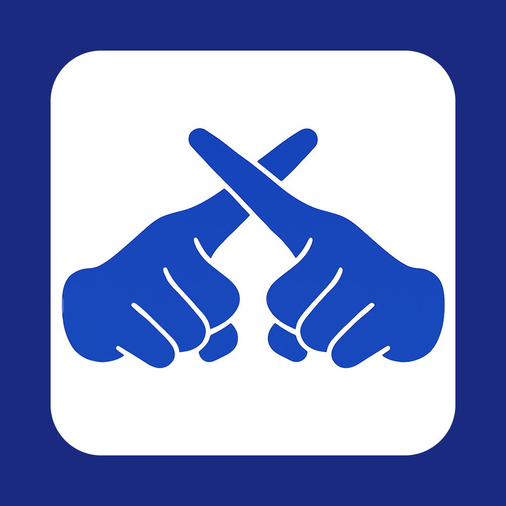

````markdown
<div align="center">
  
  <h1>SiLang - Sign Language Learning Platform</h1>
  <p><strong>Platform pembelajaran bahasa isyarat BISINDO interaktif dengan AI detection</strong></p>
  
  
  
  
  
</div>

## 📖 Tentang SiLang

**SiLang (Sign Language)** adalah platform pembelajaran bahasa isyarat Indonesia (BISINDO) yang interaktif dan mudah digunakan. Dikembangkan untuk semua usia, SiLang menggunakan teknologi AI untuk mendeteksi gerakan tangan dan memberikan feedback real-time kepada pengguna.

### ✨ Fitur Utama

- **📚 Learn Mode**: Pelajari bentuk isyarat tangan untuk setiap huruf A-Z dengan visualisasi yang jelas
- **🎯 Practice Modules**: 6 modul latihan terstruktur:
  - Modul 1-5: Latihan huruf berdasarkan kelompok (A-E, F-J, K-O, P-T, U-Z)
  - Modul 6: Latihan kata kerja dalam bahasa isyarat
- **🤖 AI Detection**: Deteksi gerakan tangan real-time menggunakan webcam
- **📱 Responsive Design**: Optimized untuk desktop dan mobile
- **🎨 Interactive UI**: Animasi smooth dengan Framer Motion
- **💾 Progress Tracking**: Penyimpanan progress pembelajaran di localStorage

### 🎯 Target Pengguna

Platform ini dirancang untuk **semua usia** yang ingin belajar bahasa isyarat Indonesia, mulai dari anak-anak hingga dewasa, termasuk:
- Pelajar dan mahasiswa
- Guru dan pendidik
- Keluarga dengan anggota tunarungu
- Masyarakat umum yang ingin belajar BISINDO

## 🚀 Demo

🌐 **Live Demo**: [https://silang-web.vercel.app](https://silang-web.vercel.app) *(akan segera tersedia)*

### 📸 Screenshots

*Screenshots fitur utama akan ditambahkan setelah deployment*

## 🛠️ Tech Stack

- **Frontend**: Next.js 14, React 18
- **Styling**: Tailwind CSS
- **Animations**: Framer Motion
- **AI Detection**: MediaPipe / Custom Hand Detection Model
- **Fonts**: Orbitron, Quicksand
- **Storage**: localStorage
- **Icons**: Lucide React

## 📦 Instalasi & Setup

### Prerequisites

- Node.js 18+ 
- npm, yarn, pnpm, atau bun

### Clone Repository

```bash
git clone https://github.com/your-username/silang-web.git
cd silang-web
```

### Install Dependencies

```bash
npm install
# atau
yarn install
# atau
pnpm install
# atau
bun install
```

### Jalankan Development Server

```bash
npm run dev
# atau
yarn dev
# atau
pnpm dev
# atau
bun dev
```

Buka [http://localhost:3000](http://localhost:3000) di browser Anda.

### Build untuk Production

```bash
npm run build
npm start
```

## 📁 Struktur Proyek

```
silang-web/
├── src/
│   ├── app/                 # App Router (Next.js 14)
│   │   ├── dashboard/       # Dashboard pages
│   │   │   ├── learn/       # Learn mode
│   │   │   └── practice/    # Practice modules
│   │   └── about/           # About page
│   ├── components/          # Reusable components
│   │   ├── dashboard/       # Dashboard-specific components
│   │   ├── practice/        # Practice session components
│   │   └── ui/              # General UI components
│   ├── lib/                 # Utilities and configurations
│   └── styles/              # Global styles
├── public/
│   ├── letters/             # Sign language images (A-Z)
│   └── LogoSiLang.png
└── README.md
```

## 🎮 Cara Penggunaan

1. **Mulai dengan Learn Mode**: Pelajari bentuk isyarat untuk setiap huruf
2. **Lanjut ke Practice**: Pilih modul latihan sesuai kemampuan
3. **Aktifkan Webcam**: Izinkan akses kamera untuk AI detection
4. **Praktik Gerakan**: Ikuti instruksi dan dapatkan feedback real-time
5. **Track Progress**: Lihat kemajuan pembelajaran Anda

## 👥 Tim Pengembang

- **[Mohammad Jonah Setiawan](https://github.com/iHanzyy)** - Web Developer
- **[Faiz Zaenal Muttaqin](https://github.com/faizaenal)** - UI/UX Designer

## 📚 Referensi

Data dan referensi bahasa isyarat berdasarkan **BISINDO (Bahasa Isyarat Indonesia)** yang merupakan sistem bahasa isyarat resmi di Indonesia.

## 🤝 Kontribusi

Kami menyambut kontribusi dari komunitas! Jika Anda ingin berkontribusi:

1. Fork repository ini
2. Buat branch fitur baru (`git checkout -b feature/AmazingFeature`)
3. Commit perubahan Anda (`git commit -m 'Add some AmazingFeature'`)
4. Push ke branch (`git push origin feature/AmazingFeature`)
5. Buat Pull Request

### Guidelines Kontribusi

- Pastikan kode mengikuti konvensi yang ada
- Tambahkan dokumentasi untuk fitur baru
- Test fitur sebelum submit PR
- Ikuti pola desain UI yang konsisten

## 📄 License

Proyek ini bersifat open source dan tersedia di bawah [MIT License](LICENSE).

## 🙏 Acknowledgments

- Terima kasih kepada komunitas BISINDO
- Inspirasi dari kebutuhan pembelajaran bahasa isyarat yang mudah diakses
- Tim penguji dan beta users

## 📞 Kontak

Jika ada pertanyaan atau saran, silakan buat [issue](https://github.com/iHanzyy/silang-web/issues) atau hubungi tim pengembang.

---

<div align="center">
  <p>Dibuat dengan ❤️ oleh Tim SiLang</p>
  <p>© 2025 SiLang. All rights reserved.</p>
</div>
````
